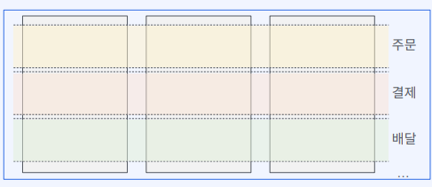

# 쿠버네티스 MSA 미션

## 미션1 - 클러스터와 네임스페이스 구성

### Snackbar 오픈! 회사에 첫 입사한 신입사원
---
- 요구사항
  1. 주문 배달이 가능한 시스템
  2. 내부 직원들이 음식 재료 구매 가능
  3. development, production 2개의 클러스터로 구성
  4. 서비스팀별 쿠버네티스 리소스 관리를 위해 클러스터를 논리적으로 구분
     - 쿠버네티스 네임스페이스 활용
     - 쿠버네티스 네임스페이스 : 리소스 그룹핑
     - 리소스 이름 중복
     - 레이블 중복, 셀렉터 오류
     - 리소스 검색/변경/삭제에 따르는 리스크
     - 리소스 접근 권한 제어 등

- 네임스페이스 구성도

- 구성요소
  - 주문
  - 결제
  - 배달
  - 구매

## 미션2 - 주문,결제,배달 어플리캐이션 시나리오
- 요구사항
  - 클라이언트 -> Order의 POST /checkout -> Payment의 GET /receipt: 영수증 조회
  - 클라이언트 -> Order의 GET /detail -> Delivery의 GET /status: 배달 상태 조회

- Service 엔드포인트
  - 파드 IP 대신 Service 이름을 이용한 통신

|네임스페이스|Service 이름(FQDN)|
|---|---|
|order|order-app.order.svc.cluster.local|
|payment|payment-app.payment.svc.cluster.local|
|delivery|delivery-app.delivery.svc.cluster.local|

## 미션3 - 주문,결제,배달 Deployment 파드 배포하기
- 도커 이미지: snackbar-order:1.0, snackbar-payment:1.0, snackbar-delivery:1.0
- 컨테이너 실행 포트는 ConfigMap으로 정의, Pod manifest 파일 선언 시 환경변수를 통해 전달