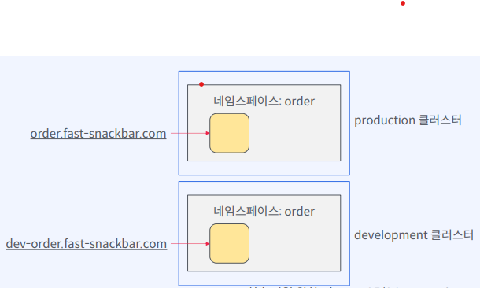

# 쿠버네티스 MSA 미션

## 미션1 - 클러스터와 네임스페이스 구성

### Snackbar 오픈! 회사에 첫 입사한 신입사원
---
- 요구사항
  1. 주문 배달이 가능한 시스템
  2. 내부 직원들이 음식 재료 구매 가능
  3. development, production 2개의 클러스터로 구성
  4. 서비스팀별 쿠버네티스 리소스 관리를 위해 클러스터를 논리적으로 구분
     - 쿠버네티스 네임스페이스 활용
     - 쿠버네티스 네임스페이스 : 리소스 그룹핑
     - 리소스 이름 중복
     - 레이블 중복, 셀렉터 오류
     - 리소스 검색/변경/삭제에 따르는 리스크
     - 리소스 접근 권한 제어 등

- 네임스페이스 구성도

- 구성요소
  - 주문
  - 결제
  - 배달
  - 구매

## 미션2 - 주문,결제,배달 어플리캐이션 시나리오
- 요구사항
  - 클라이언트 -> Order의 POST /checkout -> Payment의 GET /receipt: 영수증 조회
  - 클라이언트 -> Order의 GET /detail -> Delivery의 GET /status: 배달 상태 조회

- Service 엔드포인트
  - 파드 IP 대신 Service 이름을 이용한 통신

|네임스페이스|Service 이름(FQDN)|
|---|---|
|order|order-app.order.svc.cluster.local|
|payment|payment-app.payment.svc.cluster.local|
|delivery|delivery-app.delivery.svc.cluster.local|

## 미션3 - 주문,결제,배달 Deployment 파드 배포하기
- 도커 이미지: snackbar-order:1.0, snackbar-payment:1.0, snackbar-delivery:1.0
- 컨테이너 실행 포트는 ConfigMap으로 정의, Pod manifest 파일 선언 시 환경변수를 통해 전달
## 미션4 - Ingress 배포
- 외부 트래픽 수신을 위한 서비스별 단일 엔드포인트 생성

## 미션5 - 블루그린 배포

### 블루그린 배포란?
- 새로운 버전이 준비된 상태에서 `한번에 트래픽을 전환`하는 방법
- 그린 파드를 통해 서비스할 준비를 마친 상태에서
- 서비스 오브젝트의 목적지를 그린 파드로 변경한다
- 블루 파드는 롤백을 위해 남겨두거나 지울 수 있다.

#### 블루그린 배포의 특징
- 롤아웃/롤백이 쉽고 빠르다. 무중단 배포
- 운영환경에서 새로운 버전을 테스트하기 쉽다
- 리소스가 2배 필요하다
- 롤링업데이트는 하위 호환성을 고려해야 한다

## 미션6 - 카나리 배포

### 카나리 배포란?
- canary in a coal mine
- `소수의 새로운 버전`을 미리 배포해서 소수 사용자에게 새로운 기능을 테스트 하는 방법
- 새로운 버전의 replicas를 원하는 수만큼 배포하고 기존 파드의 replicas를 줄인다
- 새로운 버전이 안정적이라고 판단되면 완전히 기존 파드를 교체한다

### 카나리 배포의 특징
- 리스크가 크거나 새로운 기능을 소수의 사용자에게 먼저 테스트할 수 있다
- 블루그린과 달리 사용자가 받을 수 있는 좋지 않은 경험을 최소화할 수 있다
- 두 버전이 동시에 운영되기 때문에 session이나 하위 호환성 문제가 있을 수 있다